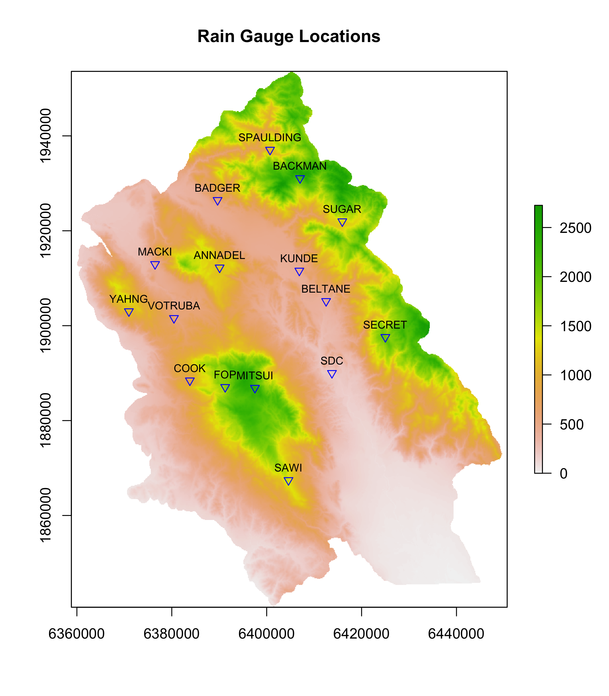

---
output:
  slidy_presentation:
    font_adjustment: 1
    footer: Center for Geospatial Analytics at NCSU
    highlight: haddock
    keep_md: yes
  beamer_presentation:
    highlight: haddock
---
## Data Manipulation with `R`

**Whalen Dillon**

December 9, 2014


## R Markdown

This is a **slidy** presentation generated using **R Markdown** in 


## Things to keep in mind about `R`
#### It is more a scripting language than programming language
`R` is optimized for vectorization (what the heck does that mean?)

Generally avoid looping operations:
```{r for loop, eval=TRUE}
data <- seq(1, 10000, by = 1)
data_squared <- NULL
 system.time(
       for(i in data){
       data_squared[i] <- data[i]^2
 })
# Vectorization is faster
system.time(data_squared <- data^2)
```

## Getting data into `R`
####Single files are pretty simple with built-in functions, e.g. 
```{r Read in file, eval=FALSE}
my_data1 <- read.csv("pathname/mydata.csv")# Read csv file
my_data2 <- read.table("pathname/mydata.txt")# Read text file, other delimiter
```
####What about a bunch of files with the same data format?

## Getting data into `R`
```{r plot rain gauge stations, eval=FALSE, echo=FALSE}
library(sp)
library(raster)
library(rgdal)
rg_0308 <- readOGR(dsn="shapefiles", layer="RainGauges2003_2008")
elev <- raster("dem/sod15m.tif")
crs <- elev@crs
rg_0308 <- spTransform(rg_0308, CRS=crs)
png(filename="rg_location.png", height = 8, width = 7, units = "in", pointsize = 12, res = 300)
plot(elev, main = "Rain Gauge Locations")
plot(rg_0308, pch = 25, col = "blue", bg="transparent", add=TRUE)
text(rg_0308, labels = rg_0308$NAME, pos = 3, cex = 0.75)
dev.off()
```


## Getting data into `R` - multiple files
####I have a directory with annual data files over 10 years
```{r List files in working directory, eval=TRUE, echo=TRUE}
files <- list.files("Rain_Gauge/2_RG_EXPORTS", pattern="*.csv", 
                    full.names=TRUE)
is.vector(files)
class(files)
length(files)
head(files, 3)
```

## Getting data into `R` - multiple files
####Read all the files in the vector "files" into a single data frame
```{r Batch read in files, eval=TRUE, echo=TRUE}
library(plyr)# `ldply()` function reads a list, returns a data frame
library(data.table)# `fread()` function
rg_data <- ldply(files, function(i){fread(i)})
class(rg_data)
head(rg_data, 3)
```

## Find out more about the data set
```{r get data structure}
str(rg_data)
```

## Dealing with dates and time
####I want to be able to group and sort by dates and times
Join `date` and `time` columns into new variable `date_time`
```{r concantenate date and time}
rg_data$date_time <- paste(rg_data$date, rg_data$time, sep=" ")
class(rg_data$date_time)
```

## Dealing with dates and time
Convert `date_time` into format interpretable by the computer (POSIX)
```{r POSIX time conversion}
rg_data$date_time <- strptime(rg_data$date_time, format="%m/%d/%Y %H:%M:%S", 
                              tz="UTC")
class(rg_data$date_time)
head(rg_data, 3)
```
<!-- [What is POSIX?](http://stackoverflow.com/questions/1780599/i-never-really-understood-what-is-posix) -->

## Dealing with dates and time
Create `year`, `month`, and `day` variables for grouping
> - Many functions can't handle POSIX formatted date/time

These functions come from the `data.table` package
```{r create date variables, echo=TRUE}
rg_data$year <- year(rg_data$date_time)# extracts year
rg_data$month <- month(rg_data$date_time)# extracts month
rg_data$day <- mday(rg_data$date_time)# extracts day of month
head(rg_data, 3)
```

## Subset and summarize data
####Create dataset of daily precipitation in inches
```{r create daily data set, echo=TRUE, message=FALSE}
library(dplyr)
dy_rg_data <- rg_data %>% 
      select(id, date, year, month, day, events) %>% 
      group_by(id, year, month, day) %>%
      summarize(daily_events=length(events), daily_ppt=length(events)*0.01)
str(dy_rg_data)
```

## Subset and summarize data
####Add a date interpretable by the computer
```{r Add date}
dy_rg_data$date <- as.Date(
      with(dy_rg_data, paste(as.character(year), as.character(month),
                             as.character(day), sep="/")), 
      format = "%Y/%m/%d")
class(dy_rg_data$date)
summary(dy_rg_data)
```

## Plot rainfall data
```{r plot daily precip, warning=FALSE, fig.height=5, fig.width=7}
library(ggplot2)
qplot(date, daily_ppt, data = dy_rg_data, geom = c("point","line"),
      ylab = "Daily rainfall (inches)", color = daily_ppt > 6)
```
Maybe a few outliers...

## Re-plot rainfall data without ouliers
```{r plot daily precip no outliers, warning=FALSE, fig.height=5, fig.width=7}
qplot(date, daily_ppt, 
      data = dy_rg_data %>% filter(daily_ppt < 6),
      geom = c("point","line"), ylab = "Daily rainfall (inches)", 
      color = year) + 
      theme_bw()
```


<!-- 
```{r, eval=FALSE, echo=FALSE}
dy_plot <- ggplot(data = dy_rg_data %>%
            filter(id == "cook" | id == "mitsui" | id == "sawi"),
            #group_by(id),
       aes(x = date, y = daily_ppt, color = id)) + 
      geom_point(size=2) +
      ylab("Daily rainfall (inches)") 
```
-->
      
<!-- 
```{r, eval=FALSE, echo=FALSE}
library(scales)
dy_plot + geom_line() + facet_grid(id ~ ., scales = "fixed") +
      theme_bw() + #theme(legend.position = "none") +
      scale_x_date(breaks = date_breaks("1 year"), 
                   labels = date_format("%m/%y"),
                   minor_breaks = "1 month") +
      xlab("date (month/year)") + ggtitle("Daily Rainfall 2004-2013")
ggsave("figures/avg_mp.svg", width = 7, height = 5, scale = 1.5)
```
-->

```{r knit to wordpress, eval=FALSE, echo=FALSE}
if (!require(RWordPress)) {
    install.packages("RWordPress", repos = "http://www.omegahat.org/R")
}# not available for OSX Mavericks or R version 3.1.2
library(RWordPress)
options(WordpressLogin = c(treesandbeer = 'deuceace21'),
        WordpressURL = 'http://whalendillon.wordpress.com/xmlrpc.php')
library(knitr)
knit2wp("presentation.Rmd", title = "Presenting Data Manipulation in R", categories = c("Blog","R","ggplot2"), shortcode = TRUE, publish = FALSE)
```

