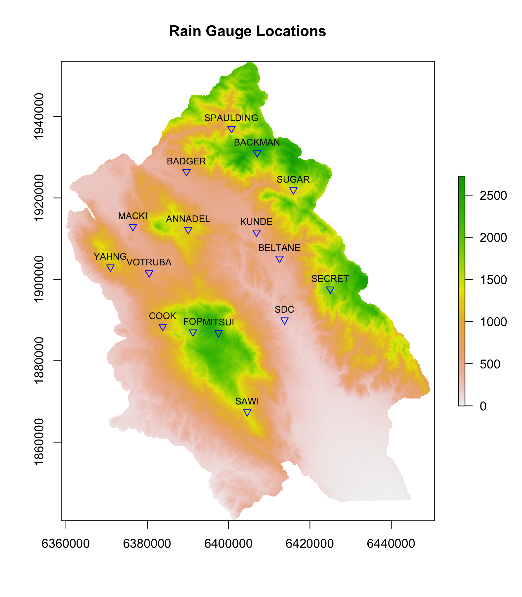
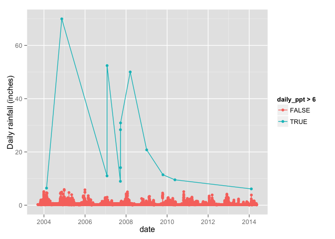
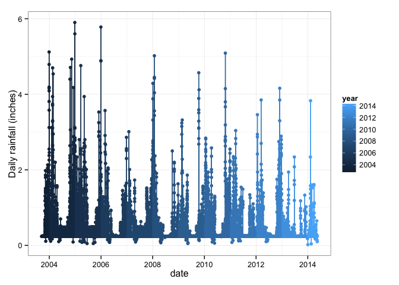

## Data Manipulation with `R`

**Whalen Dillon**

December 9, 2014


## R Markdown

This is a **slidy** presentation generated using **R Markdown** in 


## Things to keep in mind about `R`
#### It is more a scripting language than programming language
`R` is optimized for vectorization (what the heck does that mean?)

Generally avoid looping operations:

```r
data <- seq(1, 10000, by = 1)
data_squared <- NULL
 system.time(
       for(i in data){
       data_squared[i] <- data[i]^2
 })
```

```
##    user  system elapsed 
##   0.150   0.005   0.155
```

```r
# Vectorization is faster
system.time(data_squared <- data^2)
```

```
##    user  system elapsed 
##       0       0       0
```

## Getting data into `R`
####Single files are pretty simple with built-in functions, e.g. 

```r
my_data1 <- read.csv("pathname/mydata.csv")# Read csv file
my_data2 <- read.table("pathname/mydata.txt")# Read text file, other delimiter
```
####What about a bunch of files with the same data format?

## Getting data into `R`



## Getting data into `R` - multiple files
####I have a directory with annual data files over 10 years

```r
files <- list.files("Rain_Gauge/2_RG_EXPORTS", pattern="*.csv", 
                    full.names=TRUE)
is.vector(files)
```

```
## [1] TRUE
```

```r
class(files)
```

```
## [1] "character"
```

```r
length(files)
```

```
## [1] 112
```

```r
head(files, 3)
```

```
## [1] "Rain_Gauge/2_RG_EXPORTS/annadel_day_hr_2004.csv"
## [2] "Rain_Gauge/2_RG_EXPORTS/annadel_day_hr_2005.csv"
## [3] "Rain_Gauge/2_RG_EXPORTS/annadel_day_hr_2006.csv"
```

## Getting data into `R` - multiple files
####Read all the files in the vector "files" into a single data frame

```r
library(plyr)# `ldply()` function reads a list, returns a data frame
library(data.table)# `fread()` function
rg_data <- ldply(files, function(i){fread(i)})
class(rg_data)
```

```
## [1] "data.frame"
```

```r
head(rg_data, 3)
```

```
##        id       date     time events daily_events hourly_events
## 1 annadel 11/12/2003 13:00:00     NA           NA             0
## 2 annadel 11/12/2003 14:00:00     NA           NA             0
## 3 annadel 11/12/2003 15:00:00     NA           NA             0
```

## Find out more about the data set

```r
str(rg_data)
```

```
## 'data.frame':	1174694 obs. of  6 variables:
##  $ id           : chr  "annadel" "annadel" "annadel" "annadel" ...
##  $ date         : chr  "11/12/2003" "11/12/2003" "11/12/2003" "11/12/2003" ...
##  $ time         : chr  "13:00:00" "14:00:00" "15:00:00" "16:00:00" ...
##  $ events       : int  NA NA NA NA NA NA NA NA NA NA ...
##  $ daily_events : int  NA NA NA NA NA NA NA NA NA NA ...
##  $ hourly_events: int  0 0 0 0 0 0 0 0 0 0 ...
```

## Dealing with dates and time
####I want to be able to group and sort by dates and times
Join `date` and `time` columns into new variable `date_time`

```r
rg_data$date_time <- paste(rg_data$date, rg_data$time, sep=" ")
class(rg_data$date_time)
```

```
## [1] "character"
```

## Dealing with dates and time
Convert `date_time` into format interpretable by the computer (POSIX)

```r
rg_data$date_time <- strptime(rg_data$date_time, format="%m/%d/%Y %H:%M:%S", 
                              tz="UTC")
class(rg_data$date_time)
```

```
## [1] "POSIXlt" "POSIXt"
```

```r
head(rg_data, 3)
```

```
##        id       date     time events daily_events hourly_events
## 1 annadel 11/12/2003 13:00:00     NA           NA             0
## 2 annadel 11/12/2003 14:00:00     NA           NA             0
## 3 annadel 11/12/2003 15:00:00     NA           NA             0
##             date_time
## 1 2003-11-12 13:00:00
## 2 2003-11-12 14:00:00
## 3 2003-11-12 15:00:00
```
<!-- [What is POSIX?](http://stackoverflow.com/questions/1780599/i-never-really-understood-what-is-posix) -->

## Dealing with dates and time
Create `year`, `month`, and `day` variables for grouping
> - Many functions can't handle POSIX formatted date/time

These functions come from the `data.table` package

```r
rg_data$year <- year(rg_data$date_time)# extracts year
rg_data$month <- month(rg_data$date_time)# extracts month
rg_data$day <- mday(rg_data$date_time)# extracts day of month
head(rg_data, 3)
```

```
##        id       date     time events daily_events hourly_events
## 1 annadel 11/12/2003 13:00:00     NA           NA             0
## 2 annadel 11/12/2003 14:00:00     NA           NA             0
## 3 annadel 11/12/2003 15:00:00     NA           NA             0
##             date_time year month day
## 1 2003-11-12 13:00:00 2003    11  12
## 2 2003-11-12 14:00:00 2003    11  12
## 3 2003-11-12 15:00:00 2003    11  12
```

## Subset and summarize data
####Create dataset of daily precipitation in inches

```r
library(dplyr)
dy_rg_data <- rg_data %>% 
      select(id, date, year, month, day, events) %>% 
      group_by(id, year, month, day) %>%
      summarize(daily_events=length(events), daily_ppt=length(events)*0.01)
str(dy_rg_data)
```

```
## Classes 'grouped_df', 'tbl_df', 'tbl' and 'data.frame':	34870 obs. of  6 variables:
##  $ id          : chr  "annadel" "annadel" "annadel" "annadel" ...
##  $ year        : int  2003 2003 2003 2003 2003 2003 2003 2003 2003 2003 ...
##  $ month       : int  11 11 11 11 11 11 11 11 11 11 ...
##  $ day         : int  12 13 14 15 16 17 18 19 20 21 ...
##  $ daily_events: int  11 24 43 32 38 24 24 24 24 24 ...
##  $ daily_ppt   : num  0.11 0.24 0.43 0.32 0.38 0.24 0.24 0.24 0.24 0.24 ...
##  - attr(*, "vars")=List of 3
##   ..$ : symbol id
##   ..$ : symbol year
##   ..$ : symbol month
##  - attr(*, "drop")= logi TRUE
```

## Subset and summarize data
####Add a date interpretable by the computer

```r
dy_rg_data$date <- as.Date(
      with(dy_rg_data, paste(as.character(year), as.character(month),
                             as.character(day), sep="/")), 
      format = "%Y/%m/%d")
class(dy_rg_data$date)
```

```
## [1] "Date"
```

```r
summary(dy_rg_data)
```

```
##       id                 year          month             day       
##  Length:34870       Min.   :2003   Min.   : 1.000   Min.   : 1.00  
##  Class :character   1st Qu.:2005   1st Qu.: 4.000   1st Qu.: 8.00  
##  Mode  :character   Median :2008   Median : 7.000   Median :16.00  
##                     Mean   :2008   Mean   : 6.613   Mean   :15.73  
##                     3rd Qu.:2011   3rd Qu.:10.000   3rd Qu.:23.00  
##                     Max.   :2014   Max.   :12.000   Max.   :31.00  
##   daily_events       daily_ppt            date           
##  Min.   :   2.00   Min.   : 0.0200   Min.   :2003-09-17  
##  1st Qu.:  24.00   1st Qu.: 0.2400   1st Qu.:2005-10-17  
##  Median :  24.00   Median : 0.2400   Median :2008-08-10  
##  Mean   :  33.69   Mean   : 0.3369   Mean   :2008-08-25  
##  3rd Qu.:  24.00   3rd Qu.: 0.2400   3rd Qu.:2011-01-27  
##  Max.   :6998.00   Max.   :69.9800   Max.   :2014-05-14
```

## Plot rainfall data

```r
library(ggplot2)
qplot(date, daily_ppt, data = dy_rg_data, geom = c("point","line"),
      ylab = "Daily rainfall (inches)", color = daily_ppt > 6)
```

 
Maybe a few outliers...

## Re-plot rainfall data without ouliers

```r
qplot(date, daily_ppt, 
      data = dy_rg_data %>% filter(daily_ppt < 6),
      geom = c("point","line"), ylab = "Daily rainfall (inches)", 
      color = year) + 
      theme_bw()
```

 


<!-- 

-->
      
<!-- 

-->


